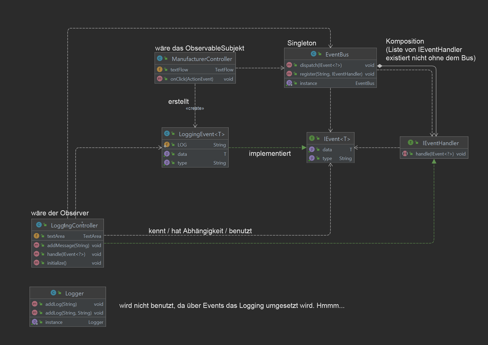
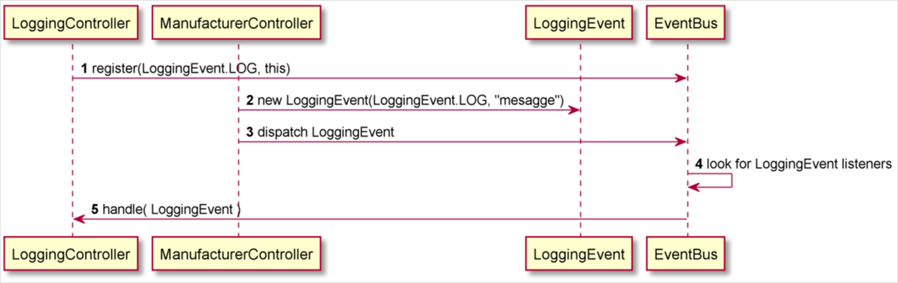

# Eventbus (basiert auf Observer und Singleton Pattern)

### Class Diagram

### Sequence Diagram

1. `LoggingController` sagt dem `EventBus` „Informiere mich, wenn ein `LogginEvent` vom Typ ´LOG´ gefeuert wird“
2. `ManufacturerController` erstellt ein neues `LoggingEvent`. Type ist hier im Grunde unnötig.
Ein eher ungünstiges Beispiel. Message ist das eigentliche relevante Argument.
3. `ManufacturerController` ruft `EventBus::dispatch` auf und übergibt das`LogginEvent`
4. `EventBus` durchsucht die Liste von Listenern und...
5. `EventBus` führt `LoggingController::handle` aus und übergibt das `LogginEvent`  